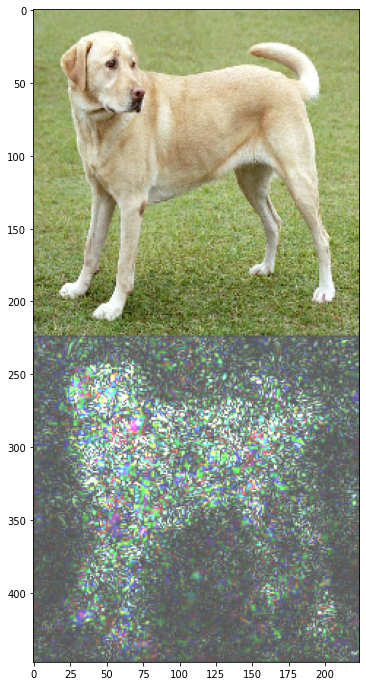
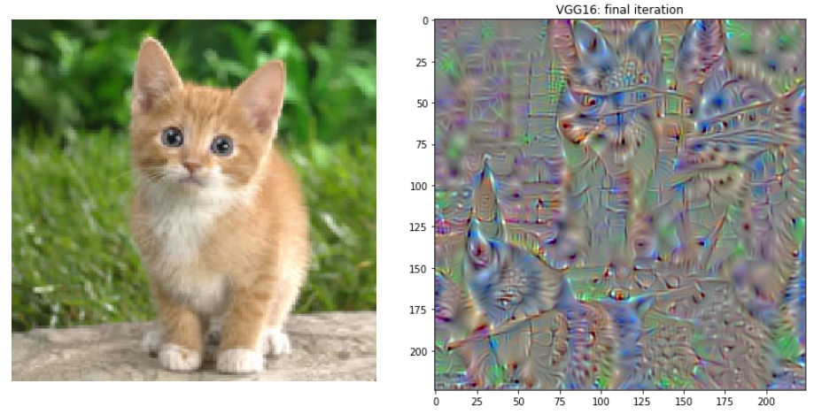
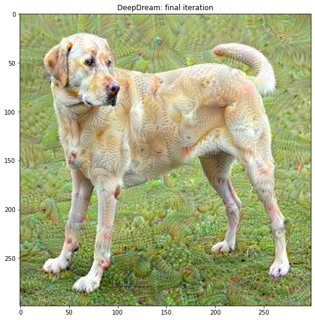
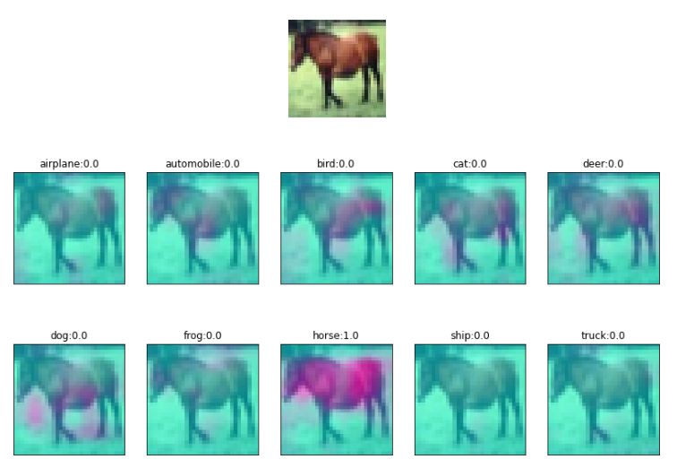
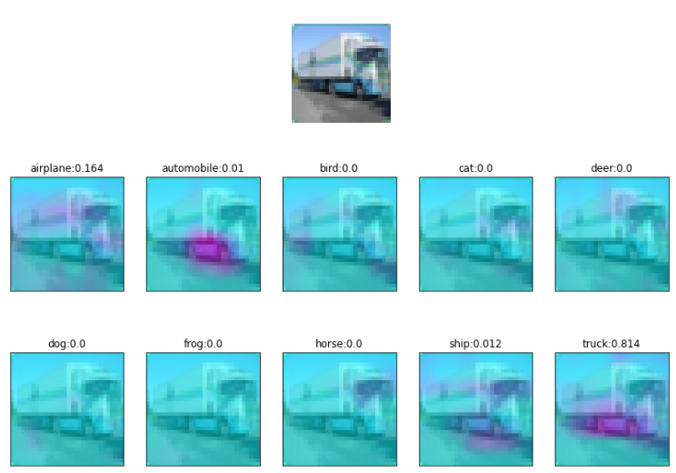
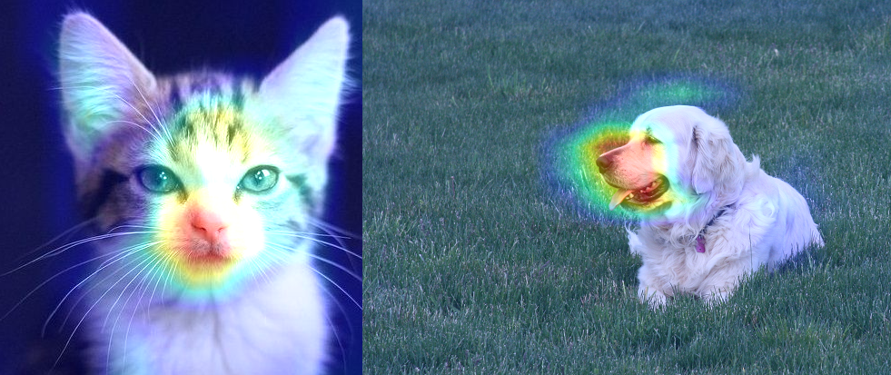

# Going deeper into CNNs through visualization methods: 
- Saliency maps 
- Optimize random image wrt neuron
- Optimize random image wrt activations content 
- Deep Dream
- GAP visualization
- Grad-CAM visualization

---
## 01 Saliency maps

Saliency maps method is based on the main idea of the well known paper: [Deep Inside Convolutional Networks](https://arxiv.org/abs/1312.6034): Visualising Image Classification Models and Saliency Maps, Where we address the task knowing where in the input are the important pixels that influence the output.

---
## 02 Optimize image wrt neuron

This is an interesting approach that tells us what kind of input excites a neuron or a set of neurons. Neurons learn to be feature detectors, and they get excited when a feature is found in the input. Usually, layers near the input are excited by basic or low level features (lines, curves, textures, colors), while deep layers are excited by high level feature (objects: faces, vehicles, animals).

---
## 03 Optimize image wrt content

The basic idea to trying to get an image that produce almost the same activations of another image. In other words, both images are almost the same in the eyes of the neural network.

---
## 04 Deep Dream

Similar to when we look at the clouds and tries to interpret shapes that we know, DeepDream also interprets and enhances the patterns it sees in an image.

---
## 05 GAP visualization

In a classification scenario, if we design the network architecture so that the final convolution consists of filters equal to the number of classes, this will force the final convolutional filters to find out how each part of the image related to each class. Moreover, we can visualize the activations as a heatmap over the input image.

After this final convolution layer, Global Average Pooling is applied across number of convolution features equal to number of classes, which results in a vector of values that we can then use to classify the input image.

---
## 06 Grad-CAM visualization

**Class Activation Map (CAM)** visualization techniques produce heatmaps of 2D class activation over input images, showing how important each location is for the considered class. 
In the paper [Grad-CAM: Why did you say that? Visual Explanations from Deep Networks via Gradient-based Localization](https://arxiv.org/abs/1610.02391), the visualization is conducted by taking the output feature map of a convolution layer (given an input image), and then weighing every channel (feature map) by the gradient of the output class wrt the feature map.

